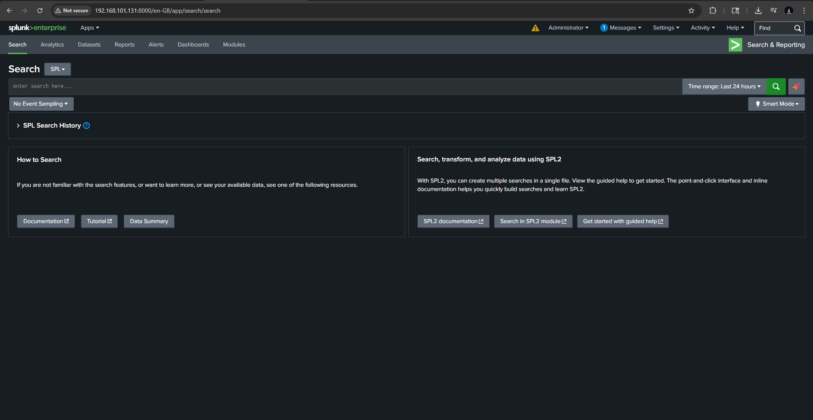

# Splunk SIEM SOC Lab

A hands-on blue team / SOC analyst lab built to simulate real-world log collection, detection engineering, and security investigation workflows using Splunk Enterprise.

This lab was designed to validate host telemetry from Windows and Linux systems, simulate attacker behavior from a Kali Linux machine, and build detections for suspicious authentication, PowerShell abuse, persistence mechanisms, LOLBins, and reconnaissance activity.

---

## What This Project Demonstrates

- Built a multi-host Splunk SIEM lab in VMware
- Ingested and validated Windows and Linux telemetry into Splunk
- Simulated attacker behavior from Kali Linux against Ubuntu and Windows hosts
- Developed detections for authentication abuse, PowerShell misuse, persistence, and recon activity
- Investigated suspicious activity using Splunk SPL and supporting evidence

---

## Key Skills Demonstrated

- Splunk Enterprise administration
- SIEM engineering and log onboarding
- Windows Event Log analysis
- Linux authentication log analysis
- Detection engineering
- Incident investigation and case documentation
- MITRE ATT&CK mapping
- Security-focused markdown documentation

---

## Lab Overview

### Systems in the Lab

- **SIEM:** Splunk Enterprise on RHEL
- **Windows Victim:** Windows Server 2025 (`192.168.101.133`)
- **Linux Victim:** Ubuntu Server (`192.168.101.139`)
- **Attacker:** Kali Linux (`192.168.101.128`)

### Data Flow

1. Windows Server forwards event logs to Splunk using Splunk Universal Forwarder.
2. Ubuntu forwards authentication and system logs to Splunk.
3. Kali is used to generate controlled attack-like activity against Ubuntu and to support the overall lab workflow.
4. Windows also runs local simulation scripts to generate high-quality Windows telemetry.

---

## Screenshots

### Lab Architecture


### Splunk Search Head


### Dashboard Overview


---

## Telemetry Coverage

### Windows

The Windows system is configured to capture and forward:

- Security logs
- PowerShell logs
- Process creation activity
- Command line visibility
- Account and group management events
- Service and scheduled task creation activity

### Important Windows Event IDs

| Event ID | Description | Why It Matters |
|---|---|---|
| 4688 | Process creation | Process execution and command-line visibility |
| 4103 | PowerShell Module Logging | Cmdlet / module usage |
| 4104 | PowerShell Script Block Logging | Script content visibility |
| 4720 | User account created | Persistence / unauthorized account creation |
| 4732 | Member added to local group | Privilege escalation / admin group changes |
| 4698 | Scheduled task created | Persistence |
| 7045 | Service installed | Service-based persistence |

---

### Linux

The Ubuntu system is configured to capture and forward:

- `/var/log/auth.log`
- authentication failures
- SSH access attempts
- invalid user enumeration attempts
- user / privilege-related activity

---

## Detection Coverage

### Linux

- Invalid Linux User Enumeration
- Repeated Failed SSH Authentication

### Windows

- Suspicious PowerShell Execution
- Encoded PowerShell Execution
- Local User Account Creation
- Local Administrators Group Modification
- Scheduled Task Creation
- Service Creation
- Certutil LOLBin Execution
- Windows Recon Commands

---

## Featured Detections

### Linux
- [`detections/linux/invalid-linux-user-enumeration.md`](detections/linux/invalid-linux-user-enumeration.md)
- [`detections/linux/repeated-failed-ssh-authentication.md`](detections/linux/repeated-failed-ssh-authentication.md)

### Windows
- [`detections/windows/suspicious-powershell-execution.md`](detections/windows/suspicious-powershell-execution.md)
- [`detections/windows/encoded-powershell-execution.md`](detections/windows/encoded-powershell-execution.md)
- [`detections/windows/local-user-account-creation.md`](detections/windows/local-user-account-creation.md)
- [`detections/windows/local-admin-group-modification.md`](detections/windows/local-admin-group-modification.md)
- [`detections/windows/scheduled-task-creation.md`](detections/windows/scheduled-task-creation.md)
- [`detections/windows/service-creation.md`](detections/windows/service-creation.md)
- [`detections/windows/certutil-lolbin-execution.md`](detections/windows/certutil-lolbin-execution.md)
- [`detections/windows/windows-recon-commands.md`](detections/windows/windows-recon-commands.md)

---

## Featured Investigation

### Ubuntu SSH Brute Force Case
- [`investigations/linux/ubuntu-ssh-bruteforce-case.md`](investigations/linux/ubuntu-ssh-bruteforce-case.md)

This investigation demonstrates how repeated SSH authentication failures and username enumeration activity can be correlated into a simple incident workflow using Splunk.

---

## Dashboard Notes

The lab includes a dashboard planning / SPL notes file to support common SOC workflows such as:

- Authentication monitoring
- PowerShell activity tracking
- Process execution visibility
- Account change monitoring
- Sysmon-ready placeholders for future expansion

See:
- [`dashboards/splunk-dashboard-notes.md`](dashboards/splunk-dashboard-notes.md)

---

## MITRE ATT&CK Coverage

| Technique | Description | Example Detection |
|---|---|---|
| T1110 / T1110.001 | Brute Force / Password Guessing | Repeated Failed SSH Authentication |
| T1087 | Account Discovery | Invalid Linux User Enumeration |
| T1059.001 | PowerShell | Suspicious / Encoded PowerShell Execution |
| T1136 | Create Account | Local User Account Creation |
| T1098 | Account Manipulation | Local Admin Group Modification |
| T1053.005 | Scheduled Task | Scheduled Task Creation |
| T1543.003 | Windows Service | Service Creation |
| T1218 | Signed Binary Proxy Execution | Certutil LOLBin Execution |
| T1082 / T1016 / T1033 | Host / Network / User Discovery | Windows Recon Commands |

---

## Key Findings

- Windows telemetry successfully captured process creation and PowerShell activity
- Linux telemetry successfully captured SSH authentication failures and invalid user enumeration
- Simulated attacker activity from Kali was observable across both Windows and Ubuntu targets
- Splunk SPL searches were validated against real lab-generated events
- Investigation workflows were documented with supporting evidence screenshots

---

## How Telemetry Was Generated

Telemetry was generated using controlled lab simulations from a Kali Linux attacker system against Ubuntu and through local simulation activity on Windows. These actions were intentionally performed to create realistic, searchable security events in Splunk.

---

## Repository Structure

```text
splunk-siem-soc-lab/
├── architecture/
├── attack-simulation/
├── dashboards/
├── data-sources/
├── detections/
│   ├── linux/
│   └── windows/
├── investigations/
│   ├── linux/
│   └── windows/
├── screenshots/
│   ├── linux/
│   └── windows/
└── README.md
