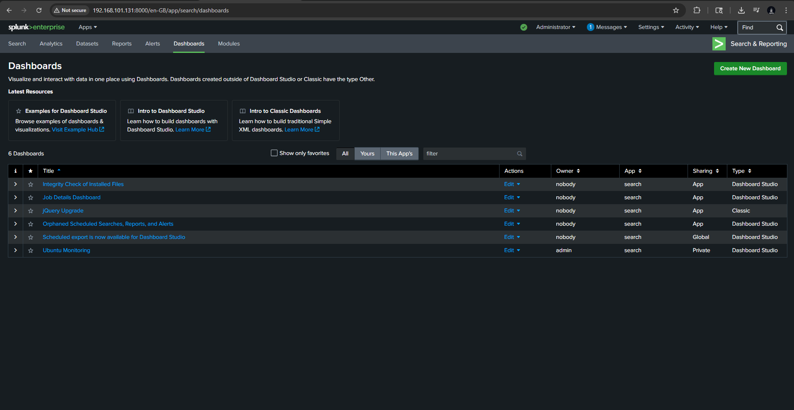

# Splunk Dashboard Notes

## Suggested Dashboards

### 1) Windows Security Overview
**Purpose:** High-level Windows event visibility

**SPL**
```spl
index=windows | stats count by source EventCode
```

### 2) Failed Logons / Linux SSH Failures
**Purpose:** Authentication abuse visibility

**SPL**
```spl
index=* source="/var/log/auth.log" ("Failed password" OR "authentication failure")
| timechart span=5m count
```

### 3) PowerShell Activity
**Purpose:** Monitor PowerShell-heavy behavior

**SPL**
```spl
index=windows (EventCode=4103 OR EventCode=4104 OR EventCode=4688)
("powershell" OR "EncodedCommand")
| timechart span=5m count by EventCode
```

### 4) Account Changes
**Purpose:** Detect user / group modifications

**SPL**
```spl
index=windows ("labsvcuser" OR "Administrators")
| table _time host EventCode source _raw
| sort - _time
```

### 5) Process Execution
**Purpose:** High-signal process activity

**SPL**
```spl
index=windows EventCode=4688
| top limit=20 New_Process_Name
```

### 6) Sysmon Overview
**Purpose:** Placeholder for future Sysmon onboarding

**Note:** Add panels here after Sysmon is installed and validated.

### Screenshot 1 — Dashboard Overview

