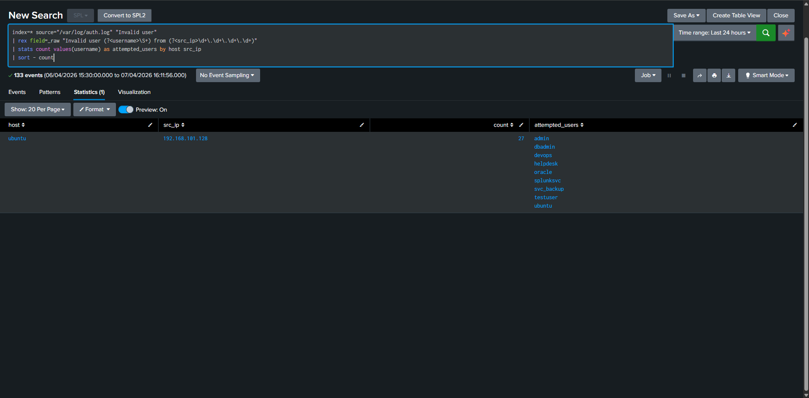
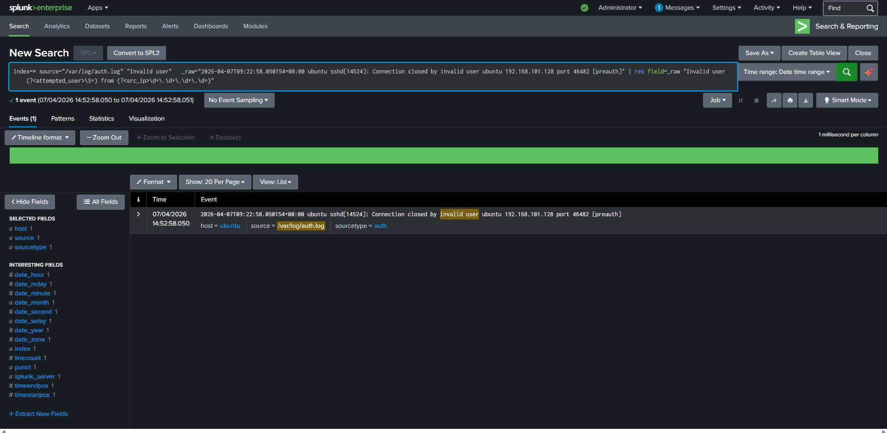

# Invalid Linux User Enumeration

## Detection Title
**Invalid Linux User Enumeration**

## Objective
Detect SSH attempts against non-existent or unexpected usernames to identify account enumeration activity.

## Environment
- **SIEM:** Splunk Enterprise
- **Host Type:** Ubuntu Server
- **Lab Scope:** Controlled VMware lab

## Data Source
- **Primary Source:** /var/log/auth.log
- **Relevant Telemetry:** Invalid user SSH events, failed passwords

## Attack Simulation Reference
- **Script:** `attack-simulation/linux/ubuntu_offense_pack.sh`
- **Scenario:** `user_enum

## Detection Logic (SPL)
```spl
index=* source="/var/log/auth.log" "Invalid user"
| rex field=_raw "Invalid user (?<username>\S+) from (?<src_ip>\d+\.\d+\.\d+\.\d+)"
| stats count values(username) as attempted_users by host src_ip
| sort - count
```

## Expected Result
Multiple invalid usernames attempted from the Kali system against the Ubuntu SSH service.

## Tuning / Noise Reduction Notes
Filter known typo-prone service accounts only if they are common in your environment.

## MITRE ATT&CK Mapping
- **Technique(s):** T1087 / T1110

## Analyst Triage Notes
Review the username list, source IP, and timing pattern. Large sets of diverse usernames often indicate enumeration or password spraying behavior.

## Investigation Steps
1. Validate source host and timestamp.
2. Review parent/child process or auth chain.
3. Identify account used and command / behavior observed.
4. Pivot to surrounding events ±15 minutes.
5. Determine if the activity was expected administrative behavior or suspicious lab-generated behavior.

## Screenshot 
### Screenshot 1 — Detection Search Results


### Screenshot 2 — Event Details

