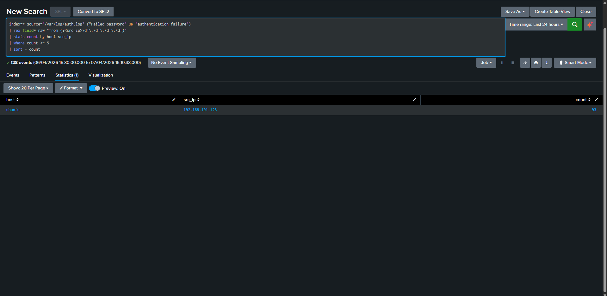
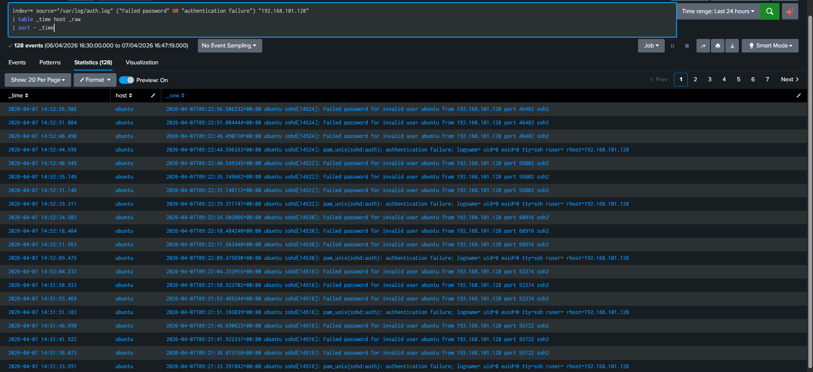

# Repeated Failed SSH Authentication Attempts

## Detection Title
**Repeated Failed SSH Authentication Attempts**

## Objective
Detect repeated SSH authentication failures from a single source IP indicative of password guessing or brute-force behavior.

## Environment
- **SIEM:** Splunk Enterprise
- **Host Type:** Ubuntu Server
- **Lab Scope:** Controlled VMware lab

## Data Source
- **Primary Source:** /var/log/auth.log
- **Relevant Telemetry:** SSH auth failures, invalid users, PAM authentication failures

## Attack Simulation Reference
- **Script:** `attack-simulation/linux/ubuntu_offense_pack.sh`
- **Scenario:** `ssh_bruteforce

## Detection Logic (SPL)
```spl
index=* source="/var/log/auth.log" ("Failed password" OR "authentication failure")
| rex field=_raw "from (?<src_ip>\d+\.\d+\.\d+\.\d+)"
| stats count by host src_ip
| where count >= 5
| sort - count
```

## Expected Result
Multiple failed SSH authentication events from Kali (192.168.101.128) against the Ubuntu host.

## Tuning / Noise Reduction Notes
Exclude known admin jump boxes or vulnerability scanners if present. Consider threshold tuning for your environment.

## MITRE ATT&CK Mapping
- **Technique(s):** T1110 / T1110.001

## Analyst Triage Notes
Confirm the source IP, target usernames, and whether the source host is authorized. Review adjacent SSH activity and any successful login that follows.

## Investigation Steps
1. Validate source host and timestamp.
2. Review parent/child process or auth chain.
3. Identify account used and command / behavior observed.
4. Pivot to surrounding events ±15 minutes.
5. Determine if the activity was expected administrative behavior or suspicious lab-generated behavior.

## Screenshot
### Screenshot 1 — Detection Search Results


### Screenshot 2 — Event Details

