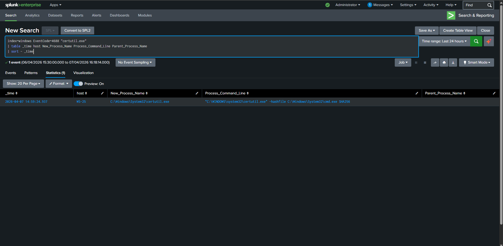
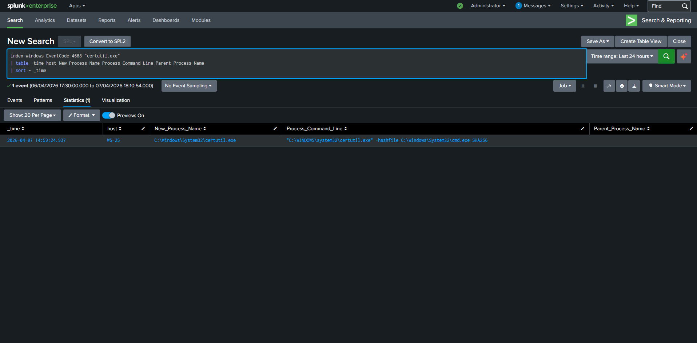

# Certutil LOLBin Execution

## Detection Title
**Certutil LOLBin Execution**

## Objective
Detect use of certutil.exe as a living-off-the-land binary.

## Environment
- **SIEM:** Splunk Enterprise
- **Host Type:** Windows Server 2025
- **Lab Scope:** Controlled VMware lab

## Data Source
- **Primary Source:** WinEventLog
- **Relevant Telemetry:** 4688 process creation with command line

## Attack Simulation Reference
- **Script:** `attack-simulation/windows/windows_offense_pack.ps1`
- **Scenario:** `LOLBins

## Detection Logic (SPL)
```spl
index=windows EventCode=4688 "certutil.exe"
| table _time host New_Process_Name Process_Command_Line Parent_Process_Name
| sort - _time
```

## Expected Result
A process creation event showing certutil.exe execution.

## Tuning / Noise Reduction Notes
Filter Splunk Universal Forwarder noise (for example `splunk-powershell.exe`) and known admin tooling. Tune for expected maintenance windows where appropriate.

## MITRE ATT&CK Mapping
- **Technique(s):** T1218

## Analyst Triage Notes
Validate the user context, parent process, command line, and related host activity. Pivot around the event to identify preceding and follow-on actions.

## Investigation Steps
1. Validate source host and timestamp.
2. Review parent/child process or auth chain.
3. Identify account used and command / behavior observed.
4. Pivot to surrounding events ±15 minutes.
5. Determine if the activity was expected administrative behavior or suspicious lab-generated behavior.

## Screenshot
### Screenshot 1 — Detection Search Results


### Screenshot 2 — Event Details

