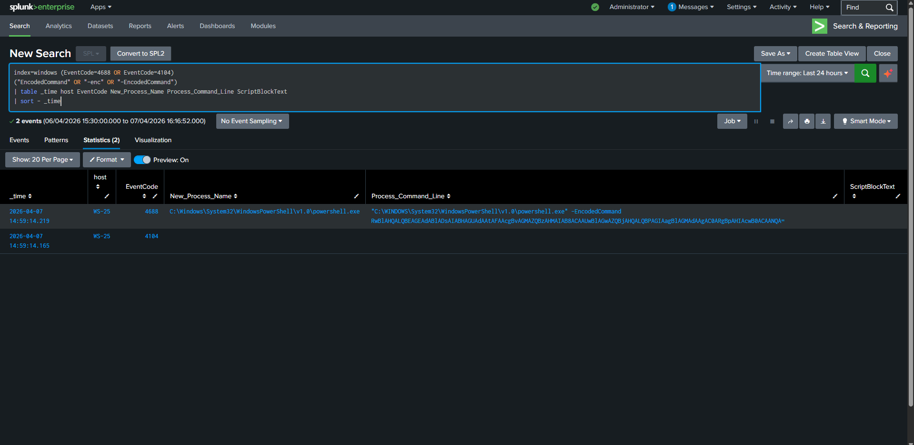
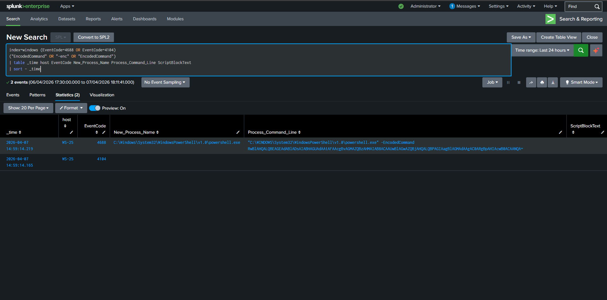

# Encoded PowerShell Execution

## Detection Title
**Encoded PowerShell Execution**

## Objective
Detect use of Base64-encoded PowerShell commands often used to obfuscate intent.

## Environment
- **SIEM:** Splunk Enterprise
- **Host Type:** Windows Server 2025
- **Lab Scope:** Controlled VMware lab

## Data Source
- **Primary Source:** WinEventLog
- **Relevant Telemetry:** 4688, 4104

## Attack Simulation Reference
- **Script:** `attack-simulation/windows/windows_offense_pack.ps1`
- **Scenario:** `EncodedPowerShell

## Detection Logic (SPL)
```spl
index=windows (EventCode=4688 OR EventCode=4104)
("EncodedCommand" OR "-enc" OR "-EncodedCommand")
| table _time host EventCode New_Process_Name Process_Command_Line ScriptBlockText
| sort - _time
```

## Expected Result
PowerShell execution containing encoded command indicators.

## Tuning / Noise Reduction Notes
Filter Splunk Universal Forwarder noise (for example `splunk-powershell.exe`) and known admin tooling. Tune for expected maintenance windows where appropriate.

## MITRE ATT&CK Mapping
- **Technique(s):** T1059.001 / T1027

## Analyst Triage Notes
Validate the user context, parent process, command line, and related host activity. Pivot around the event to identify preceding and follow-on actions.

## Investigation Steps
1. Validate source host and timestamp.
2. Review parent/child process or auth chain.
3. Identify account used and command / behavior observed.
4. Pivot to surrounding events ±15 minutes.
5. Determine if the activity was expected administrative behavior or suspicious lab-generated behavior.

## Screenshot Placement
### Screenshot 1 — Detection Search Results


### Screenshot 2 — Event Details

