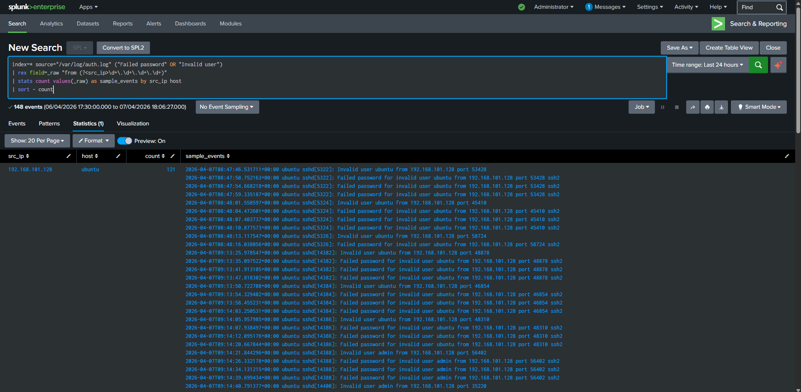
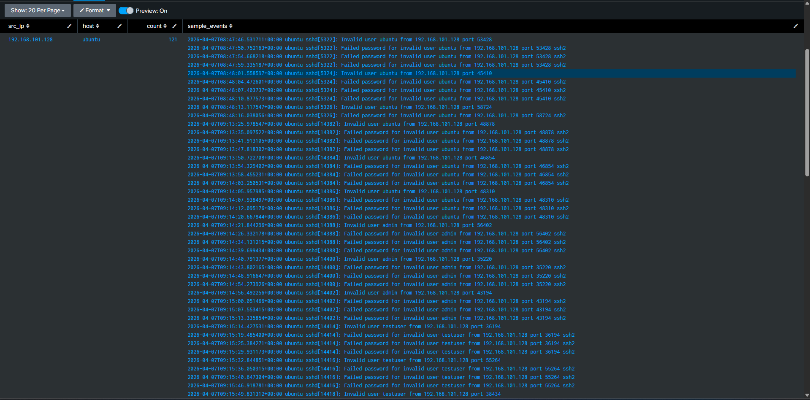
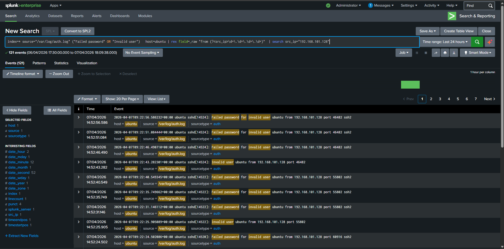

# Ubuntu SSH Brute Force / Invalid User Activity Investigation

## Executive Summary
Repeated SSH authentication failures and invalid-user attempts were generated from the Kali host against the Ubuntu server to validate Linux authentication abuse detections.

## Environment
- **Host:** Ubuntu Server (192.168.101.139)
- **Relevant IPs:** Kali: 192.168.101.128, Ubuntu: 192.168.101.139
- **SIEM:** Splunk Enterprise

## Data Source
`/var/log/auth.log` forwarded to Splunk

## Detection Logic
```spl
index=* source="/var/log/auth.log" ("Failed password" OR "Invalid user" OR "authentication failure")
| table _time host _raw
| sort - _time
```

## Timeline
- **T0:** Simulation executed
- **T1:** Telemetry ingested into Splunk
- **T2:** Detection query returned relevant events
- **T3:** Analyst reviewed event details and surrounding activity

## Findings
The source IP 192.168.101.128 generated multiple failed SSH attempts against valid and invalid usernames. The event pattern matched brute-force / enumeration style behavior.

## Impact
In a real environment, this could indicate credential guessing or pre-compromise reconnaissance against SSH-exposed systems.

## MITRE Mapping
- T1110 / T1110.001
- T1087

## Evidence
- Relevant Splunk events
- Process / auth details
- Command lines or usernames observed

## Screenshots
###  Offense Overview


###  Detection Search


###  — Event Detail


## Conclusion
The Linux authentication telemetry was successfully collected and the simulated behavior was clearly observable in Splunk.

## Recommendations
- Maintain strong logging coverage
- Create correlation rules / alerts for this behavior
- Tune detections to reduce expected administrative noise
