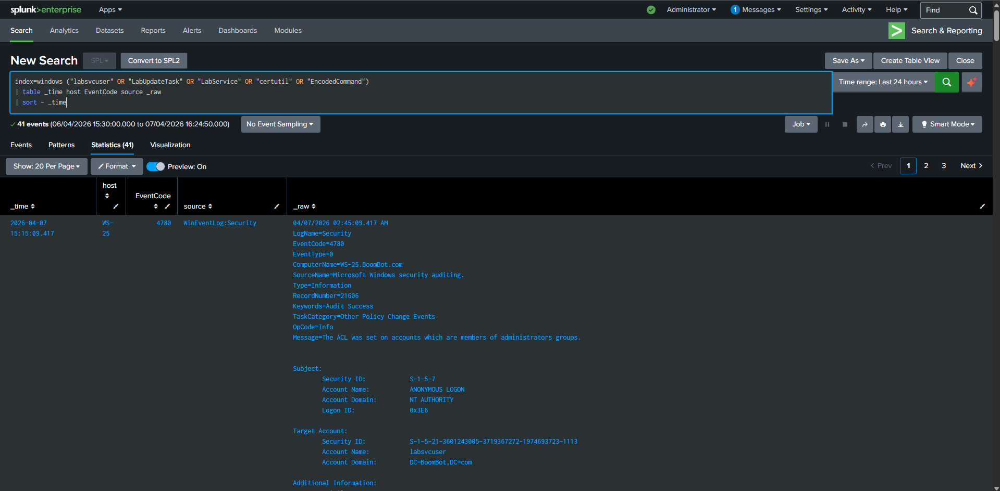
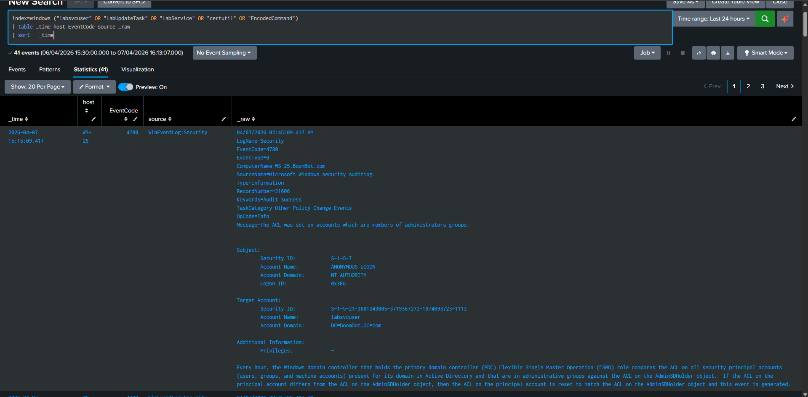
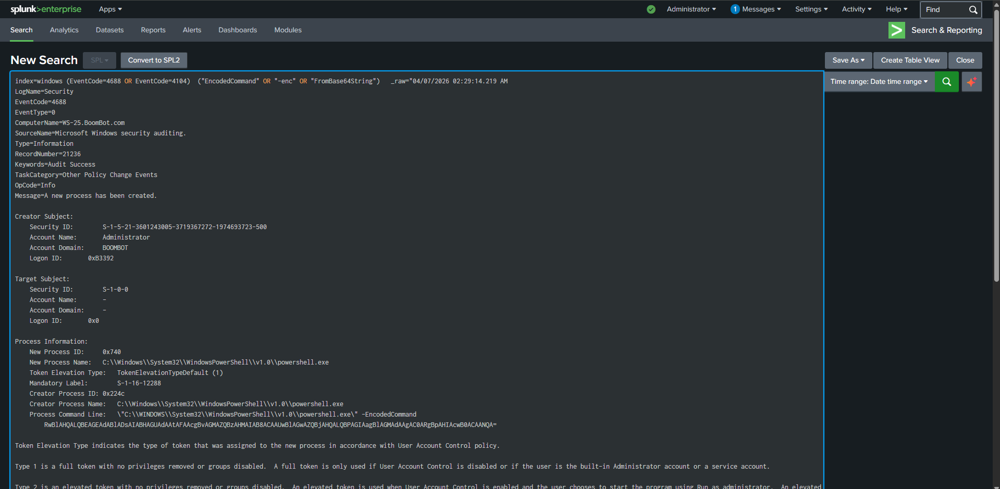

# Windows Multi-Behavior Offense Simulation Investigation

## Executive Summary
A controlled Windows offense pack generated multiple suspicious behaviors including PowerShell, LOLBins, service creation, scheduled task creation, and local account activity.

## Environment
- **Host:** Windows Server 2025 (192.168.101.133)
- **Relevant IPs:** Windows: 192.168.101.133
- **SIEM:** Splunk Enterprise

## Data Source
WinEventLog: Security / System / PowerShell / PowerShell Operational

## Detection Logic
```spl
index=windows ("labsvcuser" OR "LabUpdateTask" OR "LabService" OR "certutil" OR "EncodedCommand")
| table _time host EventCode source _raw
| sort - _time
```

## Timeline
- **T0:** Simulation executed
- **T1:** Telemetry ingested into Splunk
- **T2:** Detection query returned relevant events
- **T3:** Analyst reviewed event details and surrounding activity

## Findings
The simulation produced process creation, PowerShell, service, and utility execution telemetry. Key artifacts included certutil.exe execution, service creation, and PowerShell activity with detection value.

## Impact
In a real environment, these behaviors can represent execution, persistence, defense evasion, or discovery activity associated with hands-on-keyboard intrusion or malware staging.

## MITRE Mapping
- T1059.001
- T1027
- T1218
- T1543.003
- T1053.005
- T1136.001

## Evidence
- Relevant Splunk events
- Process / auth details
- Command lines or usernames observed

## Screenshots to Capture
### Screenshot 1 — Offense Overview


### Screenshot 2 — Detection Search


### Screenshot 3 — Event Detail


## Conclusion
The Windows telemetry pipeline successfully captured multiple attack-like behaviors and is suitable for detection engineering and investigation case studies.

## Recommendations
- Maintain strong logging coverage
- Create correlation rules / alerts for this behavior
- Tune detections to reduce expected administrative noise
